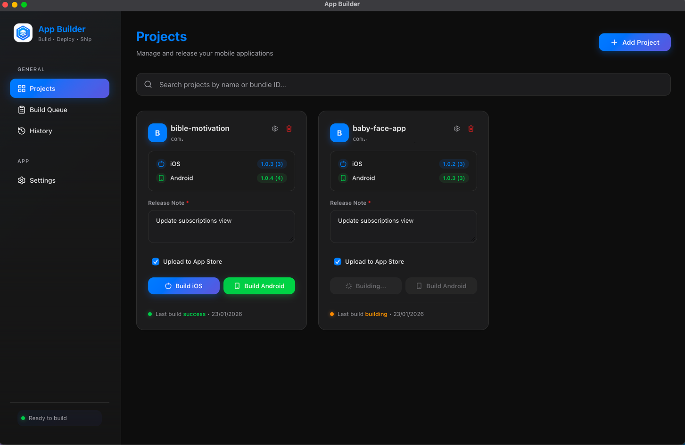
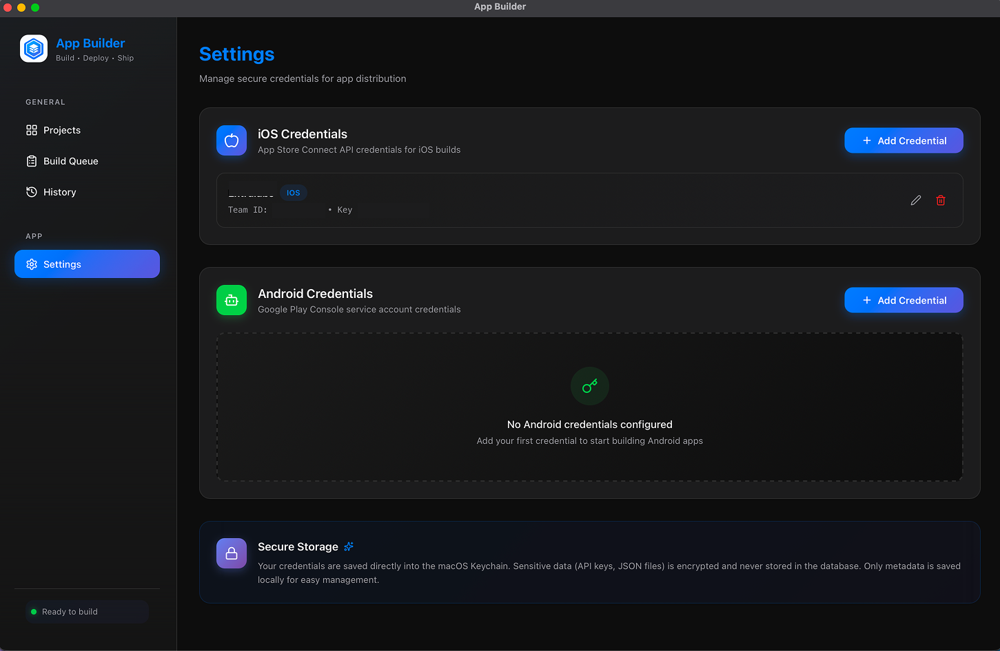
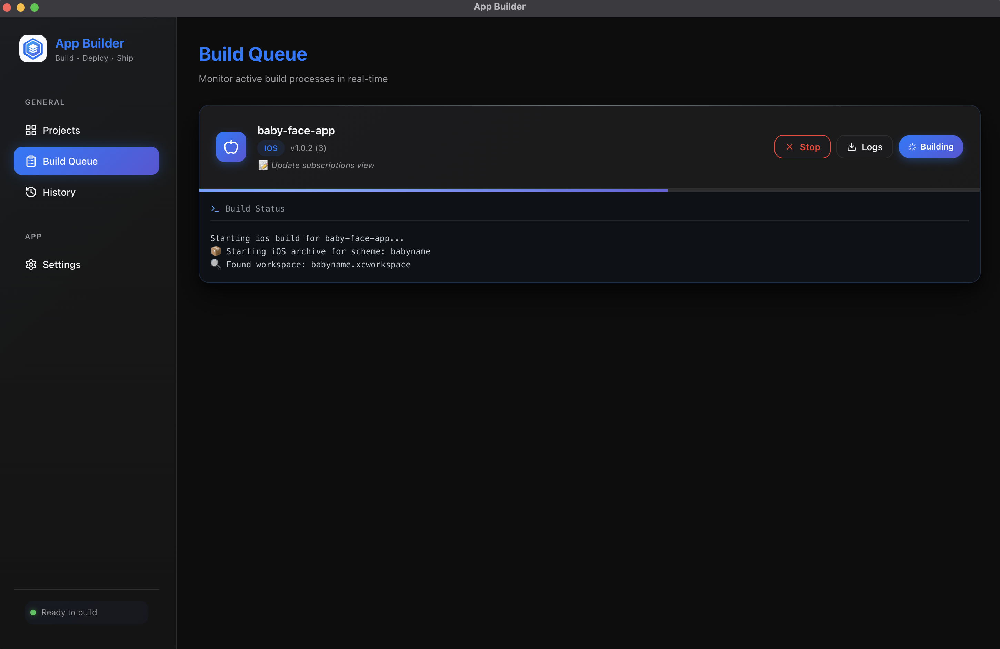

# App Builder

<p align="center">
  
</p>

<p align="center">
  
</p>

<p align="center">
  <a href="https://tauri.app/">
    
  </a>
  <a href="https://react.dev/">
    
  </a>
  <a href="https://www.typescriptlang.org/">
    
  </a>
  <a href="https://www.rust-lang.org/">
    
  </a>
</p>

<p align="center">
  <strong>A cross-platform desktop application that automates the build and release process for mobile apps.</strong>
  <br />
  Manage <b>React Native</b> and <b>Flutter</b> projects, build iOS/Android binaries, and upload directly to stores without touching the command line.
</p>

---

## 📑 Table of Contents

- [Project Goal](#-project-goal)
- [Key Features](#-key-features)
- [System Requirements](#-system-requirements)
- [Installation](#-installation)
- [User Guide](#-user-guide)
  - [Project Setup](#1-add-a-new-project)
  - [Credentials Configuration](#2-configure-credentials)
  - [Building](#3-build-ios)
- [Project Structure](#-project-structure)
- [Roadmap](#-roadmap)

---

## 🎯 Project Goal

The main goal of **App Builder** is to assist developers who manage **multiple mobile applications** simultaneously and prefer **local builds** over complex CI/CD pipelines.

**🔒 100% Local Execution:** Everything runs locally on your machine. Your source code never leaves your computer, ensuring maximum privacy and eliminating the need for expensive cloud build servers.

It requires **no special configuration**—you set up your project environment as you normally would for standard builds. This tool simply **streamlines the workflow**, automating the repetitive commands and steps, allowing you to **ship updates faster** directly from your local machine.

## ✨ Key Features

### 📱 Project Management

- **Multi-framework Support:** Manage React Native and Flutter projects in one place.
- **Auto-Discovery:** Automatically reads `Info.plist`, `build.gradle`.
- **Version Tracking:** Visual display of current version and build numbers.

### 🔨 iOS Automation

- **Build IPA:** Wrapper around `xcodebuild` with configurable export methods (Dev, Ad-hoc, Store, Enterprise).
- **Direct Upload:** Integrated `xcrun altool` for one-click upload to **App Store Connect**.

### 🤖 Android Automation

- **Build AAB/APK:** Direct Gradle execution management.

### 📊 Monitoring & History

- **Real-time Queue:** Monitor build progress, view streaming logs, and cancel operations.
- **History Log:** Keep track of every build with attached release notes.
- **Secure Vault:** Encrypts and stores API Keys and Service Accounts using system Keychain/Keyring.

---

## 🛠️ System Requirements

> [!IMPORTANT]
> To build iOS applications, you must be running macOS with Xcode installed.

### Prerequisites

- **OS:** macOS (Required for iOS), Windows/Linux (Android only - _coming soon_)
- **Node.js:** >= 18.x
- **Rust:** >= 1.70
- **Mobile SDKs:**
  - **iOS:** Xcode >= 15.0 + Command Line Tools
  - **Android:** Android Studio + SDK >= 33 + JDK 17+

---

## 🚀 Installation

### 1. Clone & Install

```bash
git clone https://github.com/bonnguyenitc/app-builder.git
cd app-builder
npm install
```

### 2. Run (Development)

```bash
npm run tauri dev
```

### 3. Build (Production)

```bash
npm run tauri build
```

### 4. Troubleshooting (macOS)

If the app fails to open ("App is damaged"), run:

```bash
sudo xattr -rd com.apple.quarantine /Applications/App\ Builder.app
```

---

## 📖 User Guide

### 1. Add a New Project

1. Go to **Projects** → **Add Project**.
2. Select your React Native or Flutter root folder.
3. The app auto-detects configuration. Review and Save.

<p align="center">
  
</p>

### 2. Configure Credentials

<p align="center">
  
</p>

<details>
<summary><strong>🍎 iOS - App Store Connect API Key (Click to expand)</strong></summary>

#### Step 1: Create API Key

1. Log in to [App Store Connect](https://appstoreconnect.apple.com/) → **Users and Access** → **Integrations** → **Team Keys**.
2. Generate a new key with **Admin** or **App Manager** role.
3. Download the `.p8` file. **Keep this safe!**
4. Note the **Key ID** and **Issuer ID**.

#### Step 2: Store the Key

Rename file to `AuthKey_<KEY_ID>.p8` and move to one of these locations:

- `~/.private_keys/` (Recommended)
- `~/private_keys/`
- `./private_keys/`

```bash
mkdir -p ~/.private_keys
cp ~/Downloads/AuthKey_ABC123XYZ.p8 ~/.private_keys/
```

#### Step 3: Add to App Builder

Go to **Settings** → **Credentials** → **Add iOS Credential**:

- **Team ID:** From Apple Developer Account (Membership details).
- **Key ID & Issuer ID:** From Step 1.
</details>

<details>
<summary><strong>🤖 Android - Google Play Service Account (Click to expand)</strong></summary>

#### Step 1: Create Service Account

1. Go to [Google Cloud Console](https://console.cloud.google.com/) → **IAM & Admin** → **Service Accounts**.
2. Create a new service account (e.g., `play-upload`).
3. **Keys** tab → **Add Key** → **Create new key** → **JSON**. Save the file.

#### Step 2: Grant Permissions

1. Go to [Google Play Console](https://play.google.com/console/) → **Users and permissions**.
2. Invite new user → Enter the email of the service account created above.
3. Grant **Admin** permissions (or specific Release permissions).

#### Step 3: Add to App Builder

Go to **Settings** → **Credentials** → **Add Android Credential**:

- Paste the full content of the **JSON Key file**.
</details>

### 3. Build iOS

1. Select Project → Click **Build iOS** (Apple Icon).
2. **Scheme:** Usually your app name.
3. **Configuration:** `Release`.
4. **Export Method:** `app-store` (for uploading) or `ad-hoc` (for testing).
5. **Upload to App Store:** Check this to auto-upload after build.

### 4. Build Android

1. Select Project → Click **Build Android**.
2. Enter **Release Notes**.
3. Toggle **Upload to Play Store** (Coming soon).

<p align="center">
  
</p>

### 5. View Build History

Track all your builds and releases in the History page.

<p align="center">
  
</p>

---

## 🗺️ Roadmap

- [x] **Core:** Project Management (RN/Flutter), Auto-info reading.
- [x] **iOS:** `xcodebuild` + Upload to App Store Connect.
- [x] **Android:** Gradle Build (AAB/APK).
- [x] **System:** Queue Management, History, Secure Credentials.
- [ ] **Android:** Upload AAB to Google Play Store (In Progress).
- [ ] **Feature:** CI/CD Pipeline integration hooks.
- [ ] **Feature:** Firebase App Distribution support.

---

## 📁 Project Structure

```bash
app-builder/
├── src/                    # React Frontend (UI)
│   ├── components/         # Reusable UI components
│   ├── stores/             # Zustand state
│   └── ...
├── src-tauri/              # Rust Backend (Core Logic)
│   ├── src/
│   │   ├── commands/       # Bridge between JS and Rust
│   │   │   ├── build.rs    # xcodebuild/gradle logic
│   │   │   └── ...
│   └── tauri.conf.json     # App configuration
└── ...
```

---

## 🔧 Configuration & Logs

> [!TIP]
> **Debug Logs:** If a build fails, check the detailed logs saved at:
>
> - **macOS:** `$TMPDIR/<project>_<platform>_<timestamp>.log`

**Output Locations:**

- **iOS:** `<project_root>/ios/build/`
- **Android:** `<project_root>/android/app/build/outputs/bundle/release/`

---

## 🤝 Contributing

Contributions are welcome! Please check out the [issues](https://github.com/your-username/app-builder/issues) or submit a PR.

## 📄 License

This project is licensed under the MIT License.
